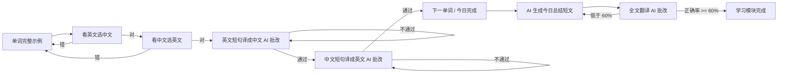

# WordFlow 词流

**输出倒逼输入的智能背单词系统**：先看完整示例，再“看英选义 → 看义选英 → 英译中 → 中译英”，全部通过后由 AI 生成包含今日单词的短文做全文翻译，正确率 ≥ 60% 才算完成；复习模块按艾宾浩斯遗忘曲线生成短文，越容易忘的单词出现频率越高。

> 开发环境默认使用离线模拟模式，无需 API Key 即可跑通全流程；接入真实大模型只需配置 `ai.*` 相关参数。

## 技术栈

| 端 | 技术 | 说明 |
| --- | --- | --- |
| 后端 | Java 17 + Spring Boot 3.3 + MyBatis-Plus + MySQL 8 | JWT 无状态认证、SpringDoc 自动文档 |
| 前端 | Vue 3 + TypeScript + Vite + Pinia + Vue Router + Element Plus | 响应式布局，移动端底部导航 |
| AI | OpenAI 兼容 Chat Completions（可换 DeepSeek / 通义千问） | 翻译批改、句子生成、短文生成 |
| 数据库 | MySQL 8.0，10 张表 | 用户 / 词书 / 词库 / 进度 / 计划 / 流水 / 短文 |

## 目录结构

```text
wordflow/
├── README.md                  # 本文件
├── docs/
│   ├── ARCHITECTURE.md        # 框架图与模块说明
│   ├── API.md                 # 接口文档
│   └── SPECS.md               # 引用的开发规范与落地说明
├── database/
│   ├── schema.sql             # 建库建表脚本（含词书表）
│   ├── migrate_book.sql       # 旧库升级为词书模式的增量脚本
│   ├── seed_words.sql         # 40 个示例单词（已并入四级词书）
│   ├── raw/                   # 下载的 JSONL 原始词书（KyleBing/english-vocabulary）
│   └── init-db.cmd            # 一键初始化数据库
├── backend/                   # Spring Boot 后端
└── frontend/                  # Vue3 前端
```

## 快速开始

### 1. 初始化数据库

```bat
cd database
init-db.cmd
```

脚本默认使用 `root / root`，与你的本机环境一致；若密码不同，请修改 `init-db.cmd` 与
`backend/src/main/resources/application.yml` 中的 `spring.datasource.password`。

如果是从旧版本升级（数据库已存在），请先执行增量迁移：

```bat
cd database
mysql -uroot -proot --default-character-set=utf8mb4 < migrate_book.sql
```

### 1.5 （可选）导入完整词书

`database/raw/` 下已下载好 8 本真实词书（四级 / 六级 / 考研 / 托福 / 雅思 / GRE / 高中 / 初中），
首次启动前在 `backend/` 目录执行一次导入（幂等，可重复执行）：

```bash
cd backend
mvn spring-boot:run -Dspring-boot.run.profiles=import -Dspring-boot.run.arguments="--wordflow.import-dir=../database/raw"
```

导入完成后，`learn_word` 将包含数万条带音标、释义、例句的真实词条，
`learn_book.word_count` 会被自动回写。词书原始数据来自
[KyleBing/english-vocabulary](https://github.com/KyleBing/english-vocabulary)（MIT 协议，仅供学习）。

### 2. 启动后端

> 注意：后端命令必须进入 `backend/` 目录执行，不要在项目根目录直接运行 `mvn`。

```bash
cd backend
mvn spring-boot:run
```

启动后：

- 接口地址：http://localhost:8080/api
- Swagger 文档：http://localhost:8080/swagger-ui.html

### 3. 启动前端

> 注意：前端命令必须进入 `frontend/` 目录执行，不要在 `backend/` 或其他目录直接运行 `npm`。
> 建议打开两个终端窗口分别启动前后端。

```bash
cd frontend
npm install   # 仅第一次需要；已安装过可跳过
npm run dev
```

如果命令报 `No plugin found for prefix 'spring-boot'`，说明你在没有 `pom.xml` 的目录（如项目根目录）运行了 `mvn`；
如果报 `Could not read package.json`，说明你在没有 `package.json` 的目录运行了 `npm`。请先用 `cd` 进入对应子目录再执行。

浏览器打开 http://localhost:5173 ，注册账号即可体验完整学习流程。

## AI 配置

默认接真实大模型（OpenAI 兼容接口，见 `backend/src/main/resources/application.yml`）：

```yaml
ai:
  provider: ${AI_PROVIDER:openai}
  base-url: ${AI_BASE_URL:https://api.deepseek.com}   # 也可换成 OpenAI / 通义千问等
  model: ${AI_MODEL:deepseek-v4-flash}
```

启动前设置密钥环境变量：`AI_API_KEY=sk-xxxx`（不要写进代码或提交到仓库）。

如需离线开发（批改为规则算法、句子与短文为模板生成），把 provider 切回模拟实现：

```bash
AI_PROVIDER=mock mvn spring-boot:run
```

## 开发规范与质量卡口

本项目按《阿里巴巴Java开发手册（嵩山版）》与《阿里巴巴前端规约 F2E-Spec》落地，并提供可执行的检查命令。

### 后端（p3c-pmd）

```bash
cd backend
mvn verify          # 含阿里规约静态检查，违规会导致构建失败
mvn pmd:check       # 只跑规约检查
```

- 规则集：`backend/p3c-ruleset.xml`，引用官方 `com.alibaba.p3c:p3c-pmd` 的 10 个 `ali-*.xml`；
- 当前裁剪（详见规则集内注释）：排除 `ClassMustHaveAuthorRule`（作者信息以 Git 记录为准）
  与 `ServiceOrDaoClassShouldEndWithImplRule`（AI 服务为策略模式的条件装配实现，
  类名体现 provider 更利于排查）；
- 卡口绑定 `verify` 阶段，Docker 构建只执行 `package`，不受影响；
- 当前状态：**63 个单元测试通过、0 条规约违规、构建成功**。

### 前端（ESLint + Prettier）

```bash
cd frontend
npm run lint         # ESLint（eslint-config-ali + typescript-eslint + eslint-plugin-vue）
npm run format:check # Prettier（prettier-config-ali）检查
npm run format       # 自动格式化
npm run check        # lint + format:check + build 全量校验
```

> 首次执行前需在 `frontend/` 下运行 `npm install`，以安装上述 lint 依赖并更新 `package-lock.json`。

职责划分：**格式化统一由 Prettier 负责**，ESLint 只保留语义与最佳实践规则；
模板格式类规则（`vue/max-attributes-per-line` 等）在 `eslint.config.mjs` 中关闭，
避免 ESLint 与 Prettier 互相覆盖。当前状态：**lint 0 错误 0 警告、格式检查通过、构建成功**。

### 本机环境注意事项

- 后端构建依赖 Maven 本地仓库。若默认仓库位于工作区之外且无权写入，
  可用仓库内附带的设置文件把本地仓库重定向到工作区内：

  ```bash
  cd backend
  mvn -s settings-workspace.xml verify
  ```

  该文件（`backend/settings-workspace.xml`）含本机绝对路径，已加入 `.gitignore`，仅本地使用；
- `wordflow` 目录若由其他账号创建，需确保当前用户对其拥有「修改」权限（NTFS ACL），
  否则 `mvn`/`npm` 无法写入 `target/` 与 `node_modules/`；目录上的 Modify 授权不能带
  `inherit-only` 标记，否则对目录自身无效。


## 核心流程

### 词书选择

用户先进入「词书」页选择一本当前词书（默认四级），「今日学习」开始时从该词书
中抽取未学单词。当天已经开始的学习计划不受换书影响，次日生效。

每本词书卡片上都有**独立的学习进度条**（已学 / 已掌握 / 剩余 / 百分比）：

- 进度按「账号 + 单词」维度统计，与「当前选中词书」无关，**切换词书不会清空任何一本书的进度**，
  8 本书的进度同时可见、实时保留；
- 一本词书学完后，可用卡片上的**「重新背诵」**按钮清空该书进度重新学习；
  该操作只影响本书，其他词书进度、历史作答记录与已生成短文都会保留。



复习模块：到期单词按紧急度排序 → 可先做「热身自测」（记得的词直接推进复习阶段）→ AI 生成复习短文（词频严格按遗忘曲线）→ 全文翻译批改 → 通过后推进所有单词的复习阶段。

### 错题本与薄弱单词

- 「错题本」页（`/mistakes`）分页列出答错过的单词，支持多选后一键「加入今日学习」；
- 加入今日学习的单词会进入当日四步练习流程，并同步创建进度行，纳入艾宾浩斯调度；
- AI 练习句会自动复现薄弱单词（最多 5 个），让易错词在真实语境中反复「输出」；
- 统计页展示「最容易出错的单词」与错题入口。

### 统计可视化

统计页在原有仪表盘基础上新增：

- **记忆阶段分布**：按艾宾浩斯 0-6 阶段与长期记忆聚合单词数量（纯 CSS 条形图，无额外图表依赖）；
- **未来 14 天复习量预测**：按用户学习日的自然日统计每日到期单词数，并单独显示已逾期数量；
- **薄弱单词概览**：答错次数最多的单词与正确率。

## 版本记录

### v0.2.0

- **词书进度**：每本词书卡片展示已学 / 已掌握 / 剩余数量与进度百分比，切换词书不清空任何一本书的进度
- **重新背诵**：词书学完后可一键清空本书进度重新学习，其他词书进度与历史记录保留
- **错题本**：分页查看答错单词的正确率与复习阶段，支持多选加入今日学习
- **复习热身**：复习前快速自测，记得的单词直接推进艾宾浩斯阶段，不熟的留给短文巩固
- **统计可视化**：记忆阶段分布、未来 14 天复习量预测、薄弱单词概览
- **AI 配置**：默认接入真实大模型（OpenAI 兼容接口），`AI_PROVIDER=mock` 可切回离线模式

## 文档索引

- [框架图与模块职责说明](docs/ARCHITECTURE.md)
- [接口文档](docs/API.md)
- [开发规范引用](docs/SPECS.md)
- [Docker 打包部署指南](docs/DEPLOY.md)

## Docker 部署

项目提供镜像构建与编排文件（后端 Java17 / 前端 Nginx / MySQL8），一条命令起全套：

```bash
copy .env.example .env      # 按需修改密钥与口令
docker compose up -d --build
docker compose --profile tools run --rm import   # 导入真实词库（一次性）
```

详细步骤、环境变量与数据库脚本说明见 [docs/DEPLOY.md](docs/DEPLOY.md)。

## 移植性设计（小程序 / Android）

- 前端将**页面组件**与**业务逻辑**分离：`api/`（网络层）、`stores/`（状态）、`types/`（模型）都不依赖 Element Plus，移植到 uni-app / Android WebView 时可整体复用；
- 后端为纯 REST + JWT，天然支持多端；
- 移植 uni-app 时只需重写 `views/` 与 `components/`（换成 uni 组件），`api/` 的请求封装替换为 uni.request 即可。

## 环境说明

- 本机已具备：Java 17、Maven 3.9.9、Node 22、MySQL 8.0、Git；
- 新增依赖均来自 Maven Central / npm registry（首次构建会自动下载）；
- 未使用 Redis / 消息队列等额外组件，当前单机架构即可运行。
