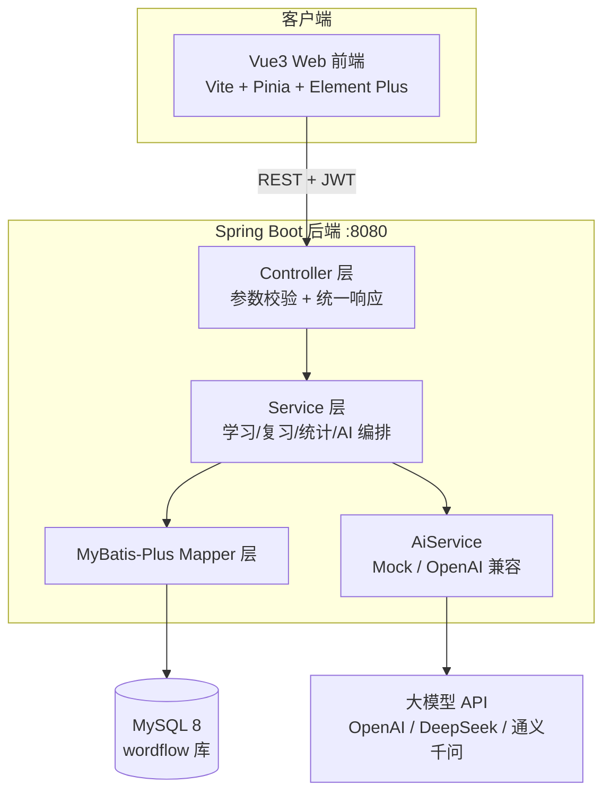
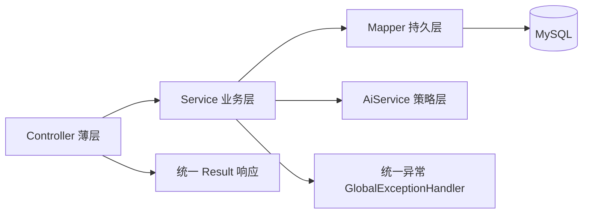
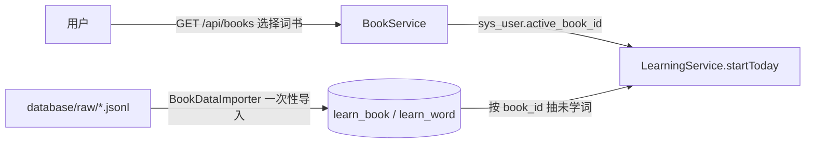
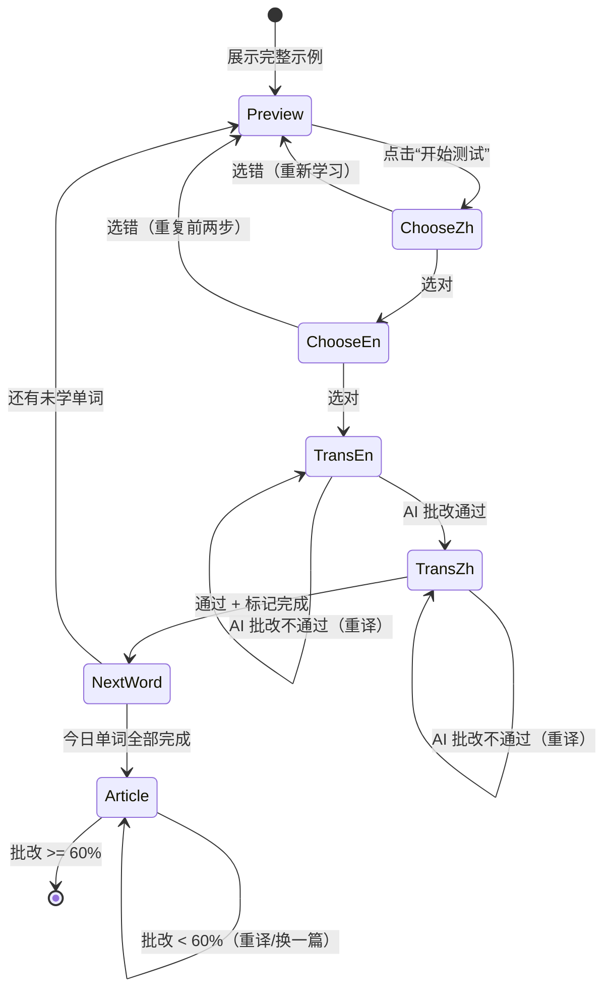

# WordFlow 架构与模块说明

## 1. 总体架构



## 2. 后端分层（遵循《阿里巴巴Java开发手册》）



## 3. 后端模块职责与“你需要完成的部分”

| 模块 | 职责 | 你需要完成 |
| --- | --- | --- |
| `common` | 统一响应、错误码、全局异常、分页 | 一般无需改；可扩展业务错误码 |
| `config` | CORS、MyBatis-Plus、OpenAPI、字段自动填充 | 生产环境收紧 CORS 白名单、关闭 Swagger |
| `security` | JWT 生成/校验、拦截器、用户上下文 | 增加角色权限时可在此扩展 |
| `module/user` `module/auth` | 注册、登录、个人资料 | 头像上传、修改密码、第三方登录 |
| `module/book` | 词书列表、用户选择当前词书 | 词书封面图、收藏/订阅、管理端维护 |
| `module/word` | 词库分页查询、按词书抽词 | 更精细的选词策略（词频/考纲优先级） |
| `module/progress` | 用户单词进度、作答流水、艾宾浩斯调度 | 个性化复习间隔参数 |
| `module/learning` | 今日学习状态机、AI 练习句、总结短文 | 断点续学到“步骤”级、错题再练 |
| `module/article` | AI 短文生成与批改、尝试记录 | 文章缓存与去重 |
| `module/review` | 到期单词筛选、紧急度、复习文章批改 | 基于历史正确率的个性化词频 |
| `module/statistics` | 仪表盘、近 7 天、最近作答 | 留存率、准时复习率报表 |
| `module/ai` | 大模型策略（mock / openai）、调用日志 | 接入公司网关、限流熔断重试 |

词书数据流：



## 4. 学习流程状态机



## 5. 艾宾浩斯调度设计

间隔（天）：`[1, 2, 4, 7, 15, 30]`，即学完后约第 1、3、7、14、29、59 天复习。

| 阶段 stage | 含义 | 下次复习 |
| --- | --- | --- |
| 0 | 学习中 | 无 |
| 1 | 刚学会，待首次复习 | +1 天 |
| 2 | 通过第 1 轮 | +2 天 |
| 3 | 通过第 2 轮 | +4 天 |
| 4 | 通过第 3 轮 | +7 天 |
| 5 | 通过第 4 轮 | +15 天 |
| 6 | 通过第 5 轮 | +30 天 |
| 7+ | 通过全部 6 轮 | 状态 COMPLETE，长期记忆 |

复习文章词频规则（`ReviewService#urgency`）：

```text
优先级 = 1（基础）
       + min(2, 逾期天数)          // 越逾期越紧急
       + (stage <= 2 ? 1 : 0)      // 早期阶段更容易忘
上限 4
```

复习到期时间统一锚定到「用户学习日 + 间隔天数」的日边界，所有时间均按
`sys_user.timezone`（首次登录由前端自动采集）计算，不依赖服务器时区。
夜猫子适配：

1. 设置页可配置 `day_boundary_hour`（如 4:00），凌晨该点前背的词算前一天，次日自动到期；
2. 保持默认 0 点时，系统检测凌晨（0:00-`night_cutoff_hour`，默认 6）背过的单词，
   白天登录通过 `GET/POST /api/review/night-prompt` 弹窗询问是否提前加入今日复习，
   每天最多询问一次。

## 6. 前端目录结构（业务域划分）

```text
frontend/src/
├── api/          # 网络层：request 封装 + 各业务域接口（可移植）
├── stores/       # Pinia 状态（可移植）
├── types/        # 与后端一致的模型定义（可移植）
├── router/       # 路由与登录守卫
├── layouts/      # 主布局（桌面侧栏 / 移动底部导航）
├── components/   # 通用组件：WordCard / ChoiceGrid / TranslationPanel 等
├── views/        # 页面：首页/学习/复习/词库/统计/设置
└── styles/       # 设计变量与全局样式
```

移植到小程序 / Android 时：`api`、`stores`、`types` 可整体复用，仅需重写 `views` 与 `components`。
